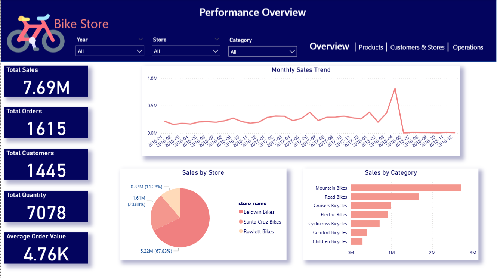
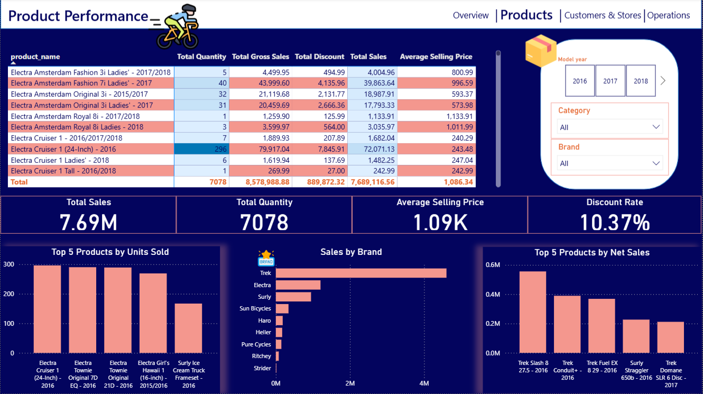

# 🚲 Bike Store Performance Analysis | Power BI

## 📌 Project Overview

An interactive Power BI dashboard built to analyze bike-store sales performance and provide actionable business insights.

The analysis focuses on sales, products, customers, stores, and order delivery performance.

### Business Questions

- How is the business performing overall?
- Which products, categories, and brands generate the most revenue?
- Which customers and stores contribute most to sales?
- How efficiently are orders processed and shipped?
- Where are the main business opportunities and risks?

---

## 🛠️ Tools & Technologies

- Power BI
- Power Query
- DAX
- Data Modeling
- Star Schema
- Data Cleaning & Transformation

---

## 🧩 Data Model

A **Star Schema** was created with `Fact_Sales` as the central fact table.

**Fact Table Grain:** Order Line level — each row represents one product within a specific order.

Main dimensions include:

- Product
- Customer
- Store
- Staff
- Date

---

## 🧮 Key Calculations

```text
Gross Sales = Quantity × List Price

Discount Amount = Gross Sales × Discount

Net Sales = Gross Sales − Discount Amount
```

### Main KPIs

- Total Sales
- Total Gross Sales
- Total Discount
- Total Orders
- Total Quantity
- Total Customers
- Average Order Value
- Average Selling Price
- Discount Rate
- Average Shipping Days

---

## 📊 Dashboard

### Performance Overview



### Product Performance



### Customer & Stores Performance


### Operations & Delivery


---

## 💡 Key Insights

- **Total Sales:** approximately **7.69M**
- **Total Orders:** **1,615**
- **Total Units Sold:** **7,078**
- **Total Customers:** **1,445**
- **Baldwin Bikes** contributes approximately **68% of total sales**.
- **Mountain Bikes** are the top-performing category.
- **Trek** is the leading brand by sales.
- Revenue is highly concentrated in a small number of stores and brands.
- The 2018 sales trend shows a significant anomaly that requires further data validation.

---

## 🎯 Recommendations

- Improve performance of underperforming stores.
- Focus inventory and marketing on high-performing categories.
- Reduce dependency on a single store or brand.
- Evaluate products using both units sold and revenue.
- Develop strategies to increase repeat purchases.
- Validate the 2018 sales anomaly before making business decisions.

---

## 📁 Repository Structure

```text
bike-store-sales-powerbi/
│
├── Dashboard/
│   └── Bike_Store_Sales.pbix
│
├── Screenshots/
│   ├── Overview.png
│   ├── Product.png
│   ├── Customer&Stores.png
│   └── Operations&Delivery.png
│
└── README.md
```

## 👩‍💻 Author

**Mariam Ali Hassan**  
Junior Data Analyst | Power BI | SQL | Excel | Python
